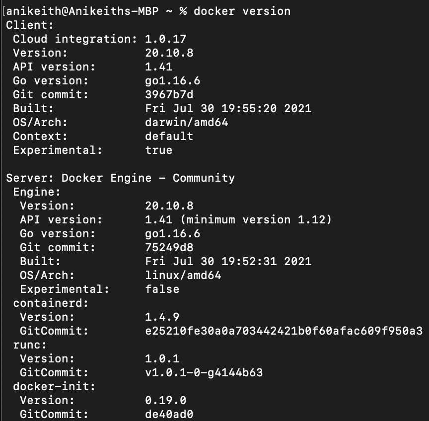
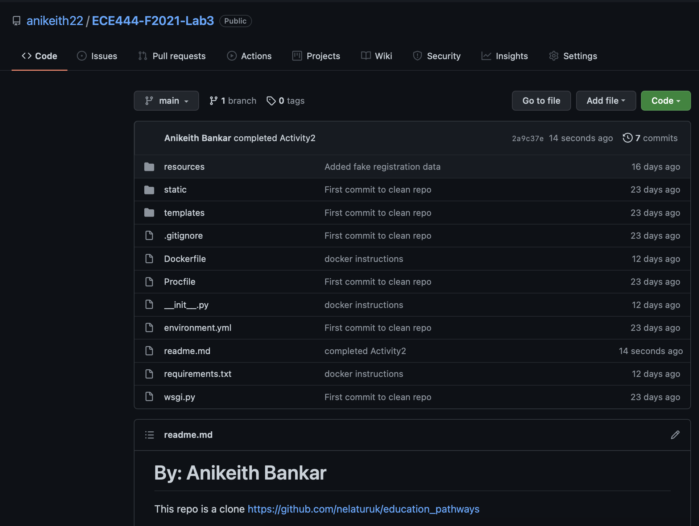
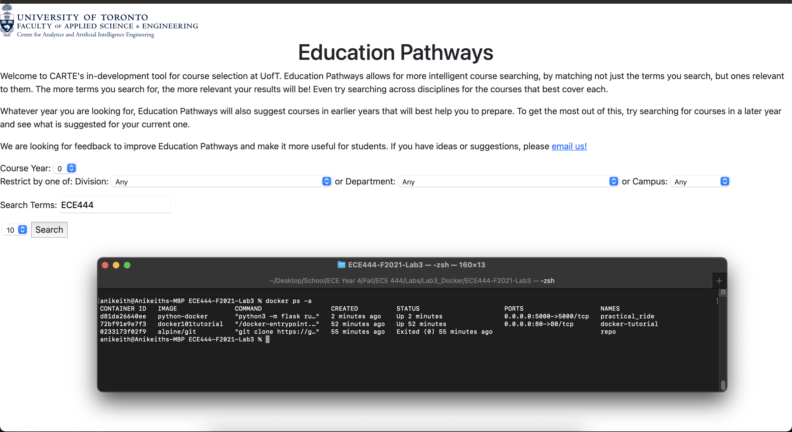

# By: Anikeith Bankar 

This repo is a clone https://github.com/nelaturuk/education_pathways

# Activity 1

# Activity 2

# Activity 3

# Activity 4

# Activity 5

Functional Requirement: Being able to input a course code and for it to actually show with its details.\
Non-Functional Requirement: Being able to filter the courses by alphabetical/course offering times
